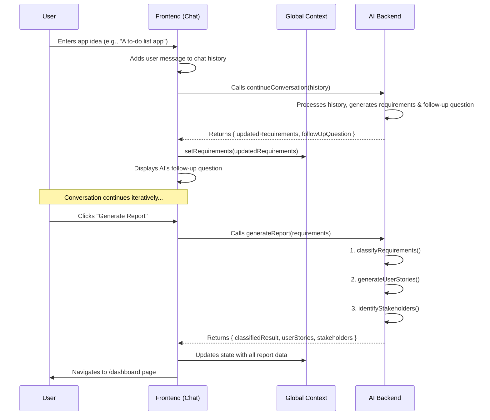

# Project Report: ReqArchitect 🤖

---

## 1. Title Page

**Project Title:** ReqArchitect: An AI-Powered Assistant for Software Requirement Engineering

**Author:** Ahmed

**Date:** July 26, 2024

---

## 2. Abstract

The traditional process of software requirement engineering is often complex, time-consuming, and prone to human error, forming a significant bottleneck in the Software Development Life Cycle (SDLC). ReqArchitect is a modern web application designed to address these challenges by leveraging the power of large language models. Built with Next.js and Google's Gemini models via the Genkit framework, this project introduces an intelligent chatbot that acts as an AI business analyst. It engages users in a natural conversation to elicit, refine, and document software requirements. The system automates the classification of requirements, generation of user stories, and identification of key stakeholders, culminating in a comprehensive, exportable project report. ReqArchitect aims to democratize the requirement-gathering process, making it faster, more collaborative, and more efficient for technical and non-technical stakeholders alike.

---

## 3. Introduction

In the domain of software engineering, the requirement elicitation and management phase is universally acknowledged as one of the most critical stages. A well-defined set of requirements forms the bedrock of a successful project, ensuring that the final product aligns with user expectations and business goals. However, this phase is fraught with difficulties, including communication gaps between stakeholders and developers, ambiguous specifications, and the sheer manual effort required to document and organize everything.

The recent advancements in Generative AI present a transformative opportunity to innovate this process. AI can understand natural language, reason about complex ideas, and structure information in a specified format.

**ReqArchitect** is a project that harnesses this potential. It is an interactive, AI-driven tool designed to streamline and automate key aspects of requirement engineering. By providing a conversational interface, it lowers the barrier to entry for stakeholders, allowing them to express their ideas in plain English. The AI assistant then intelligently processes this input, asks clarifying questions to resolve ambiguity, and structures the information into a formal set of requirements. This not only accelerates the initial brainstorming phase but also enhances the quality and completeness of the final documentation, leading to more efficient and successful software development projects.

---

## 4. Problem Statement

The primary problem this project addresses is the **inefficiency, high cost, and potential for ambiguity in the traditional software requirement gathering process.**

Key pain points include:

1.  **Manual Effort & Time Consumption:** Requirement elicitation often involves numerous meetings, workshops, and extensive manual documentation, consuming significant time and resources.
2.  **Dependence on Specialized Skills:** The process typically relies on skilled business analysts to translate stakeholder needs into formal technical specifications, creating a dependency and potential bottleneck.
3.  **Ambiguity and Misinterpretation:** Requirements documented in natural language are often open to interpretation, leading to misunderstandings between what the client wants and what the development team builds.
4.  **Poor Stakeholder Engagement:** Non-technical stakeholders may find the formal requirement process intimidating or inaccessible, leading to incomplete input and a final product that doesn't fully meet their needs.
5.  **Static Documentation:** Traditional requirement documents are often static and difficult to update, making iterative refinement a cumbersome task.

**ReqArchitect** aims to solve these problems by providing an automated, accessible, and intelligent platform that assists in the elicitation, analysis, and documentation of software requirements, thereby reducing manual effort and improving the clarity and completeness of the project's foundation.

---

## 5. Hardware and Software Requirements

### Hardware Requirements
As a web-based application, ReqArchitect does not impose any specific hardware requirements on the end-user beyond what is needed to run a modern web browser.
*   **Device:** A computer, tablet, or smartphone.
*   **Processor:** 1 GHz or faster.
*   **RAM:** 2 GB or more.
*   **Internet Connection:** A stable internet connection is required to communicate with the backend services and AI models.

### Software Requirements

#### End-User
*   **Operating System:** Any modern OS (e.g., Windows 10/11, macOS, Linux, iOS, Android).
*   **Web Browser:** An up-to-date web browser such as Google Chrome, Mozilla Firefox, Safari, or Microsoft Edge.

#### Development Environment
*   **Operating System:** Windows, macOS, or Linux.
*   **Runtime Environment:** [Node.js](https://nodejs.org/en) (v18 or later recommended).
*   **Package Manager:** [npm](https://www.npmjs.com/) or another compatible manager like Yarn or pnpm.
*   **IDE/Code Editor:** Visual Studio Code, WebStorm, or any other preferred editor.
*   **AI Service:** An API key for Google's Gemini models.

---

## 6. Diagrams (Structural and Behavioural)

### A. Structural Diagram: Component Architecture

This diagram illustrates the high-level component architecture of the Next.js frontend, showing how state management, UI components, and pages are organized.

```
[ RootLayout (layout.tsx) ]
 |
 +-- [ AppStateProvider (app-state-provider.tsx) ] -- (Global State: requirements, userStories, etc.)
 |    |
 |    +-- [ Header (header.tsx) ] -- (Nav Links, Theme Toggle)
 |    |
 |    +-- [ Children (Page Content) ]
 |         |
 |         +-- (/) -- [ ChatView (chat-view.tsx) ]
 |         |     |
 |         |     +-- [ ChatMessage (chat-message.tsx) ] -- (Displays user/AI message)
 |         |     |
 |         |     +-- [ ChatInput (chat-input.tsx) ] -- (User input form)
 |         |     |
 |         |     +-- [ RequirementsDisplay (in sidebar) ] -- (Lists current requirements)
 |         |
 |         +-- (/dashboard) -- [ RequirementsDashboard (requirements-dashboard.tsx) ]
 |               |
 |               +-- [ DataTable (data-table.tsx) ] -- (Displays, filters, sorts requirements)
 |               |     |
 |               |     +-- [ columns.tsx ] -- (Defines table structure and actions)
 |               |
 |               +-- [ EditRequirementDialog (edit-requirement-dialog.tsx) ]
 |               |
 |               +-- [ UserStoryCard / StakeholderCard ]
 |
 +-- [ Genkit Flows (src/ai/flows/*.ts) ] -- (Backend AI Logic)
      |
      +-- continueConversation
      +-- generateReport
      +-- classifyRequirements
      +-- generateUserStories
      +-- identifyStakeholders
```

### B. Behavioural Diagram: User Interaction Flow (Sequence Diagram)

This diagram shows the sequence of interactions when a user chats with the AI to generate requirements and create a report.



---

## 7. How It Works

The application operates through a seamless integration of a modern frontend and a powerful generative AI backend.

1.  **Frontend Interaction:**
    *   The user interacts with a chat interface built with **React** and **Next.js**. All UI elements are standard, reusable components from the **shadcn/ui** library, styled with **Tailwind CSS**.
    *   Global state, such as the cumulative list of requirements, user stories, and stakeholders, is managed using **React Context** (`AppStateProvider`). This ensures that data is consistently available across different pages and components.

2.  **Conversational AI:**
    *   When a user sends a message, the frontend calls a server action that triggers the `continueConversation` Genkit flow.
    *   This flow receives the entire conversation history. It uses a **Google Gemini** model to analyze the text, update the list of software requirements based on the new input, and formulate a relevant follow-up question to elicit more detail.
    *   The flow returns the updated requirements and the new question to the frontend, which updates the UI accordingly.

3.  **Report Generation:**
    *   When the "Generate Report" button is clicked, the `generateReport` server action is invoked.
    *   This action orchestrates calls to several specialized Genkit flows:
        *   `classifyRequirements`: Categorizes each requirement.
        *   `generateUserStories`: Creates user stories from functional requirements.
        *   `identifyStakeholders`: Identifies relevant user roles.
    *   Each of these flows uses a specifically engineered prompt to instruct the Gemini model to return data in a structured JSON format, which is then parsed and sent back to the frontend.

4.  **Dashboard and Export:**
    *   The data from the report generation process is stored in the global state and displayed on the `/dashboard` page.
    *   The data table on the dashboard uses **TanStack Table** to provide rich features like sorting and filtering.
    *   The "Export to PDF" functionality uses the `jspdf` and `jspdf-autotable` libraries to dynamically generate a professional-looking PDF document containing all the generated report data directly in the browser.

---

## 8. Screenshots of Output Screens

#### Main Chat Interface
*A clean, responsive layout for conversational requirement gathering.*


#### Dashboard View
*A comprehensive dashboard displaying the generated Requirement Repository, User Stories, and Stakeholders.*


---

## 9. Reference

This project was built using industry-standard tools and libraries. Official documentation for these technologies served as the primary reference material.

*   **Next.js:** [https://nextjs.org/docs](https://nextjs.org/docs)
*   **React:** [https://react.dev/](https://react.dev/)
*   **Genkit (for Google AI):** [https://firebase.google.com/docs/genkit](https://firebase.google.com/docs/genkit)
*   **shadcn/ui:** [https://ui.shadcn.com/](https://ui.shadcn.com/)
*   **Tailwind CSS:** [https://tailwindcss.com/docs](https://tailwindcss.com/docs)
*   **TanStack Table:** [https://tanstack.com/table/v8](https://tanstack.com/table/v8)
*   **jsPDF:** [http://raw.githack.com/MrRio/jsPDF/master/docs/](http://raw.githack.com/MrRio/jsPDF/master/docs/)
